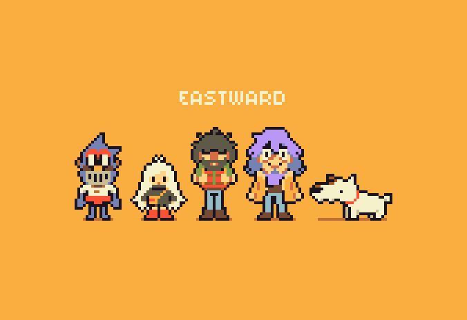

 

    Hi there, I'm Luis Dorr :wave:

  

 

  <!-- Work Links -->
  
   
  
  <!-- Social Links -->
  
  

<!-- OTH Links -->
  
  
  

## :nerd_face: About me
I'm a 20-year-old Brazilian. I'm studying Computer Science at University of Vale do Rio dos Sinos(5th semester). I've been working as an Infra Analyst, as my first job in IT, although I've been trying to become a Developer, but without success. ;-;

I love programming and all forms of art. I'm addicted to acquiring new knowledge and skills, as well as studying and understanding everything that involves computing or technology.

## :briefcase: Hard Skills

### Languages: 
     

#### Unit test: 

          
#### Data analysis tools:
          

#### Containerisation:
 
          
#### Data Base:

          
#### Versioning: 
  
          
#### IDEs: 
          
                 

|  |  |  |
| :-: | :-: | :-: |

 |  |
| :-: | :-: |

    
||
| :-: |

## :seedling: Learning
- Having my first contact with data science.
- Studying and practising for the EY Open Science Data Challenge Program.
- Revising the database
- Improving my skills with Zabbix

